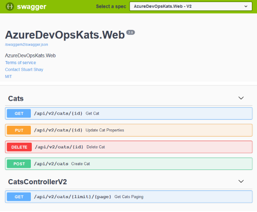
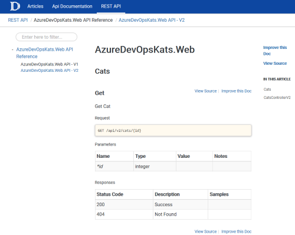

# AzureDevOpsKats

[](http://sonar.navigatorglass.com:9000/dashboard?id=9c944632fe7a37d24b533680dac1e45b5b34fea7)
[](http://sonar.navigatorglass.com:9000/dashboard?id=9c944632fe7a37d24b533680dac1e45b5b34fea7)
[](http://sonar.navigatorglass.com:9000/dashboard?id=9c944632fe7a37d24b533680dac1e45b5b34fea7)
[](http://sonar.navigatorglass.com:9000/dashboard?id=9c944632fe7a37d24b533680dac1e45b5b34fea7)


[](https://hub.docker.com/r/stuartshay/azuredevopskats/)
[](https://microbadger.com/images/stuartshay/azuredevopskats:2.1.1-base "microbadger.com")
[](https://microbadger.com/images/stuartshay/azuredevopskats:2.1.9-build "microbadger.com")


| Job                           | Agent        | Status                                                  |
| ------------------------------| -------------|---------------------------------------------------------|
| Sonarqube Code Quaility       | Travis       |[](https://travis-ci.org/stuartshay/AzureDevOpsKats) |
| Windows/Linux Automated Build | Appveyor     |[](https://ci.appveyor.com/project/StuartShay/azuredevopskats) |
| Windows/Linux Automated Build | Azure Devops |[](https://dev.azure.com/AzureDevOpsKats/AzureDevOpsKats/_build/latest?definitionId=1)
| Docker Base Image             | Jenkins      |[](https://jenkins.navigatorglass.com/job/AzureDevOpsKats/job/AzureDevOpsKats-base/) 
| Docker Deploy Image           | Jenkins      |[](https://jenkins.navigatorglass.com/job/AzureDevOpsKats/job/AzureDevOpsKats-api/)

|  Library                    |  Nuget Repository                        |  MyGet Repository                                       |
| --------------------------- | -----------------------------------------|---------------------------------------------------------|
| AzureDevOpsKats.Data        | [![Nuget][data-nuget-badge]][data-nuget] | [![MyGet][data-myget-badge]][data-myget]                |
| AzureDevOpsKats.Service     | [![Nuget][service-nuget-badge]][service-nuget] | [![MyGet][service-myget-badge]][service-myget]    |


[data-myget]: https://www.myget.org/feed/azuredevopskats/package/nuget/AzureDevOpsKats.Data
[data-myget-badge]: https://img.shields.io/myget/azuredevopskats/v/AzureDevOpsKats.Data.svg?label=AzureDevOpsKats.Data

[data-nuget]: https://dev.azure.com/AzureDevOpsKats/AzureDevOpsKats/_packaging?_a=package&feed=635e0ad8-8571-488f-82e0-3fb74d47f178@cb8ef0ed-1b6f-446b-a654-7d71a3c6c5b3&package=ba6134fb-0db5-4ffb-a27f-be12b753c8d3&preferRelease=true
[data-nuget-badge]: https://feeds.dev.azure.com/AzureDevOpsKats/_apis/public/Packaging/Feeds/635e0ad8-8571-488f-82e0-3fb74d47f178@cb8ef0ed-1b6f-446b-a654-7d71a3c6c5b3/Packages/ba6134fb-0db5-4ffb-a27f-be12b753c8d3/Badge


[service-myget]: https://www.myget.org/feed/azuredevopskats/package/nuget/AzureDevOpsKats.Service
[service-myget-badge]: https://img.shields.io/myget/azuredevopskats/v/AzureDevOpsKats.Service.svg?label=AzureDevOpsKats.Service

[service-nuget]: https://dev.azure.com/AzureDevOpsKats/AzureDevOpsKats/_packaging?_a=package&feed=635e0ad8-8571-488f-82e0-3fb74d47f178&package=ba6134fb-0db5-4ffb-a27f-be12b753c8d3&preferRelease=true
[service-nuget-badge]: https://feeds.dev.azure.com/AzureDevOpsKats/_apis/public/Packaging/Feeds/635e0ad8-8571-488f-82e0-3fb74d47f178/Packages/ba6134fb-0db5-4ffb-a27f-be12b753c8d3/Badge

## Instalation & Run Instructions

```
git clone https://github.com/stuartshay/AzureDevOpsKats.git

cd AzureDevOpsKats
dotnet restore

cd src\AzureDevOpsKats.Web\
dotnet run
```

### Cake

#### Prerequisites:
```
Java Lattest JDK/JRE
```

Windows    

```
.\build.ps1
```

Linux/Mac

```bash
chmod +x build.sh
```

```bash
./build.sh
```

### SonarQube Testing

**Windows** 
```
 ./build.ps1 -target=sonar
```

**Mac/Linux**
```
./build.sh -target=sonar
```

## Web Site

The Site can be accesed at the following url

```
http://localhost:5000/
```


## Swagger API Documentation

```
http://localhost:5000/swagger/index.html
```


### DocFX

DocFX generates Documentation directly from source code (.NET, RESTful API, JavaScript, Java, etc...) and Markdown files.

```
https://dotnet.github.io/docfx/
```



#### Prerequisites:

```powershell
choco install docfx
```

#### Build and Serve Website

```powershell
docfx docfx/docfx.json
docfx docfx/docfx.json --serve
```

```
http://localhost:8080
```
#### Deployment 
```powershell
 .\build.ps1 -target=Generate-Docs
