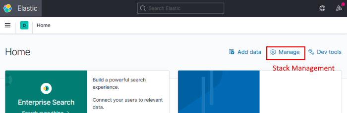
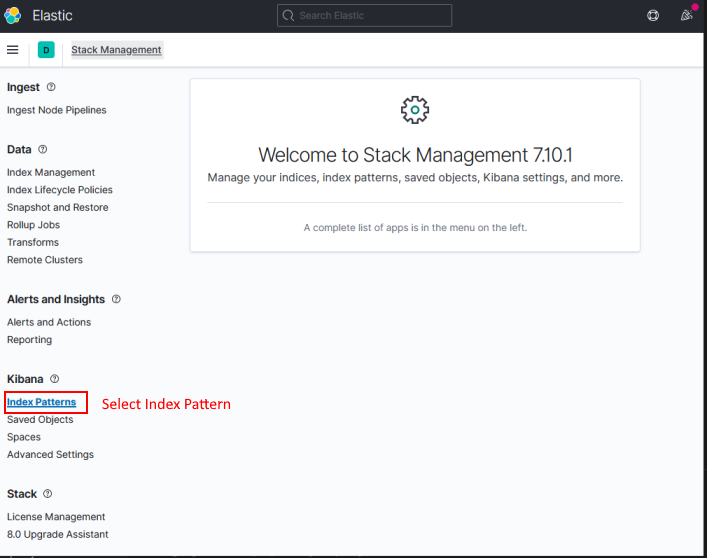
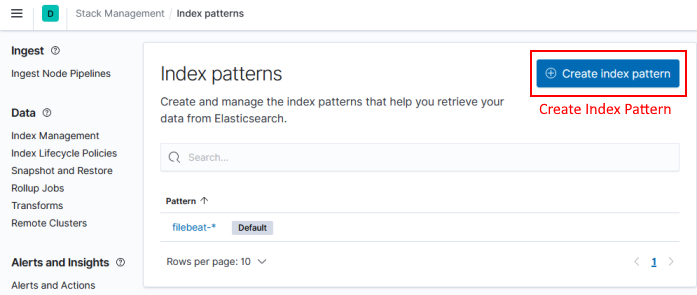

## Elastic Search 

### Setup Index Patterns





Goto Stack Management



Create Index       



```
azuredevopskats-logs-*
filebeat-*
```

## 

```
https://www.elastic.co/guide/en/elasticsearch/reference/7.10/index-mgmt.html
```

## Elastic Search Plugins

```
sudo bin/elasticsearch-plugin list
```


### Clear Docker Container Log File
```
docker inspect --format='{{.LogPath}}' <container id/name>

truncate -s 0 /path/to/logfile
```
