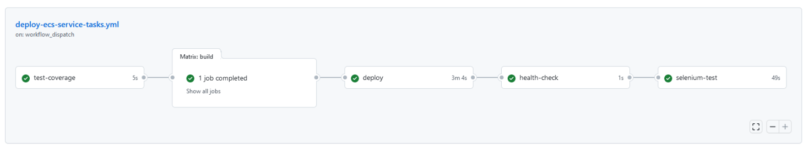
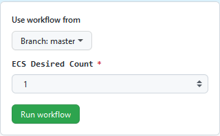

# ECS Service Tasks

[](https://github.com/stuartshay/AzureDevOpsKats/actions/workflows/deploy-ecs-service-tasks.yml)

ECS Service Tasks Workflow Deployment



## Workflow Dispatch

Overide Workflow Defaults



ECS Cluster Deployment

| Branch               | ECS Cluster    |
| -------------------- | -------------- |
| master               | master-devops  |
| devlop, feature, fix | develop-devops |

Master Branch Deployment override

| ECS Desired Count |                             |
| ----------------- | --------------------------- |
| 1,2,5             | Number of Fargate ECS Tasks |
| 0                 | Terminate all Tasks         |

## Workflow Steps

### test-coverage

[](https://github.com/stuartshay/AzureDevOpsKats/actions/workflows/ci-cd-action.yml)

- .NET Build & Lint
- .NET Unit Testing and Code Coverage
- Image Vulnerability Scanning

### build

- .NET Build
- Create Docker Image
- Push Image to Amazon ECR

### deploy

Configure and Deploy ECS Fargate Container and definition

- [Set Fargate task definition parameters](https://docs.aws.amazon.com/AmazonECS/latest/developerguide/task_definition_parameters.html)
- Set Container Secrets & Environment Variables
- [Mount Common EFS Storage Volumes](https://aws.amazon.com/efs/)

#### Ecspresso Deployment Tool

```
https://github.com/kayac/ecspresso
```

#### develop branch

- Git Event : Push

#### master branch

- Git Event : Push, Pull Request

### health-check

- Check ECS Deployment and Application Health
- Validate Release Tag Matches Running Container Tag

[Health Check Endpoint](http://master-devops-1727857016.us-east-1.elb.amazonaws.com/health)

### selenium-test

- Application Smoke and UI Testing

| Test Type                                  | Workflow                                                                                                                                                                                                       | Docker Image                                                                                                                                                                 |
| ------------------------------------------ | -------------------------------------------------------------------------------------------------------------------------------------------------------------------------------------------------------------- | ---------------------------------------------------------------------------------------------------------------------------------------------------------------------------- |
| [selenium-screenshot](../docker/selenium/) | [](https://github.com/stuartshay/AzureDevOpsKats/actions/workflows/selenium.workflow.yml) | [](https://hub.docker.com/r/stuartshay/azuredevopskats-selenium/tags) |
